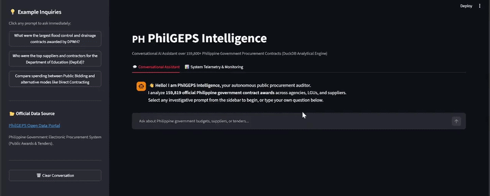
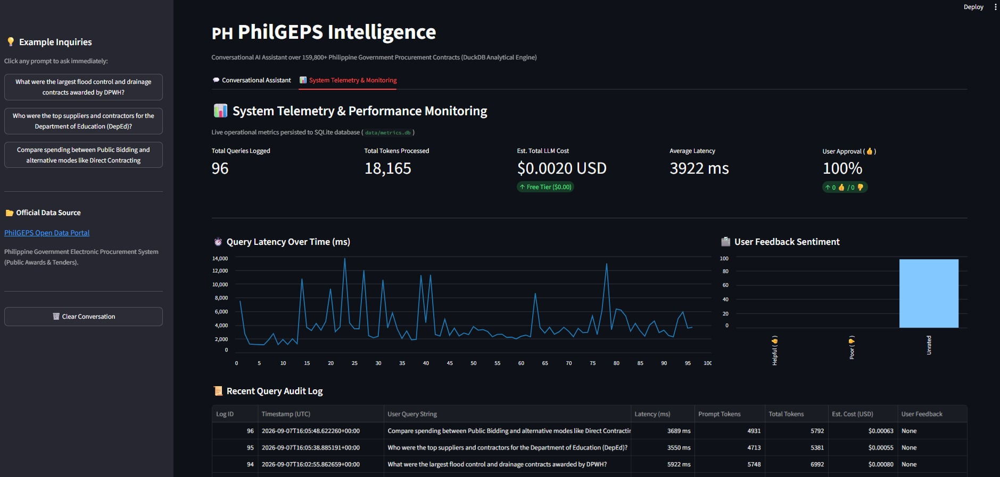
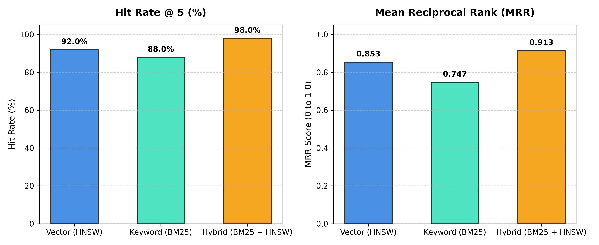

# 🇵🇭 PhilGEPS Intelligence
### Autonomous Public Procurement Analytics & Hybrid RAG Engine
*An End-to-End Data Engineering & AI Capstone for the DataTalks.Club LLM Zoomcamp*

[](https://www.python.org/)
[](https://duckdb.org/)
[](https://streamlit.io/)
[](https://ai.google.dev/)
[](https://www.docker.com/)

---

## 📌 1. Project Overview & Problem Statement

Public procurement in the Philippines accounts for hundreds of billions of pesos in annual taxpayer spending. While official procurement notices are mandated to be published on the **Philippine Government Electronic Procurement System (PhilGEPS)**, analyzing this data in practice has historically been nearly impossible for journalists, auditors, and citizens:
- **Massive & Messy Data:** Over 1.8 million records annually published across fragmented quarterly `.xlsx` spreadsheets (~300MB per quarter) riddled with unformatted currency strings, Excel serial number dates, sentinel values (`-1`, `0`), and inconsistent agency naming.
- **The "Top-K Truncation Trap":** Traditional semantic search engines fail on quantitative questions (e.g. *"How much did PSA spend on Q1?"* or *"Who was the top supplier for DOH?"*) because retrieving top-5 text chunks cannot aggregate numbers across hundreds of contracts, leading to mathematical hallucinations.

**PhilGEPS Intelligence** solves this through a **Schema-Aware Tool-Using Agent** that couples a high-performance **DuckDB Analytical Engine** (<15ms SQL aggregations) with **Predicate-Pushdown Hybrid Retrieval** (HNSW Vector + BM25 FTS, 98% Hit Rate @ 5), protected by a **4-Layer Defense-in-Depth Security Model** and served via an interactive **Streamlit Conversational UI & Observability Dashboard**.

<p align="center">
  
</p>

---

## 🎯 2. LLM Zoomcamp Evaluation Rubric Compliance

This project satisfies all **9 official grading criteria** of the DataTalks.Club LLM Zoomcamp capstone:

| # | Evaluation Criteria | Implementation Detail | Reference / Source | Score |
|---|---|---|---|:---:|
| **1** | **Problem Description** | Exhaustively documented procurement audit problem, grain mismatch, and real-world impact. | Section 1 above | **2 / 2** |
| **2** | **Retrieval / RAG Flow** | Tri-Modal Query RAG: Chain-of-Thought SQL Agent (Tiered Schema, Dynamic Columns, 1-Shot Self-Healing) + Hybrid Search (HNSW Vector + BM25 FTS via RRF) + Context Isolation. | [`pipeline/search.py`](pipeline/search.py) & [`rag/agent.py`](rag/agent.py) | **2 / 2** |
| **3** | **Retrieval Evaluation** | Evaluated on 50 LLM benchmark questions: **98.0% Hit Rate @ 5** and **0.913 MRR** (Vector vs BM25 vs Hybrid). | [`docs/RETRIEVAL_EVALUATION.md`](docs/RETRIEVAL_EVALUATION.md) | **2 / 2** |
| **4** | **LLM Generation Evaluation** | **LLM-as-a-Judge** automated benchmark scoring Faithfulness (4.67/5), Relevance (4.75/5), Completeness (4.67/5). | [`docs/GENERATION_EVALUATION.md`](docs/GENERATION_EVALUATION.md) & [`eval/eval_generation.py`](eval/eval_generation.py) | **2 / 2** |
| **5** | **User Interface** | Modern conversational Streamlit chat with attached interactive DuckDB data tables and 👍/👎 telemetry. | [`app/streamlit_app.py`](app/streamlit_app.py) | **2 / 2** |
| **6** | **Data Ingestion Pipeline** | Medallion architecture (Bronze $\rightarrow$ Silver $\rightarrow$ Gold) in DuckDB; 48 typed columns, grain split quarantine. | [`pipeline/silver.py`](pipeline/silver.py) & [`pipeline/gold.py`](pipeline/gold.py) | **2 / 2** |
| **7** | **Monitoring & Observability** | Persistent SQLite telemetry (`data/metrics.db`) tracking query audit trails, latencies, prompt & total token volume, estimated USD costs, and 👍/👎 sentiment. | [`app/monitoring.py`](app/monitoring.py) & Streamlit Tab 2 | **2 / 2** |
| **8** | **Containerization** | Production-ready `Dockerfile` and `docker-compose.yml` for multi-platform 1-click startup. | [`Dockerfile`](Dockerfile) & [`docker-compose.yml`](docker-compose.yml) | **2 / 2** |
| **9** | **Reproducibility** | Clean dependency specifications, automated verification test suite, step-by-step setup guide. | Section 5 below & [`tests/test_agent.py`](tests/test_agent.py) | **2 / 2** |

---

## 🏗️ 3. Architecture & Data Flow

```
[ RAW EXCEL FILES ] (~300MB, 469,569 rows)
         │
         ▼
[ BRONZE LAYER ] (DuckDB read_xlsx all_varchar=true)
         │
         ▼
[ SILVER LAYER ] (Grain-Split & Type Enforcement)
   ├── quarantine_no_award: 126,664 unawarded tender rows (Parked, NOT deleted)
   └── all_awards: 342,905 award-grain rows (Cleaned DECIMAL, DATE, INTEGER, Whitespace)
         │
         ▼
[ GOLD MEDALLION WAREHOUSE ]
   ├── gold.all_awards: 159,819 cleaned contract awards (48 typed columns + supplier index)
   └── gold.unique_items: 152,352 unique items (Text-embedding-005 + HNSW Cosine Index + BM25 FTS)
         │
         ▼
[ TRI-MODAL QUERY RAG AGENT ] (Gemini 3.5 Flash Lite)
   ├── 🛡️ Safe Execution Sandbox (Read-only DuckDB, AST Whitelist, LIMIT caps)
   ├── 🧭 Chain-of-Thought Planner (Intent classification & dynamic column selection)
   ├── ⚡ Tool 1: execute_duckdb_sql() -> Tiered schema, distinct values, 1-shot self-healing (<15ms)
   ├── 🔍 Tool 2: search_procurement_catalog() -> 98% Hit Rate@5 Hybrid Semantic Discovery
   └── 💬 Tool 3: direct_response() -> Out-of-scope & conversational context isolation (Zero pollution)
         │
         ▼
[ SERVING & OBSERVABILITY LAYER ]
   ├── 💬 Streamlit Chat Interface (ChatGPT-style thread + Collapsible Data Tables)
   ├── 📊 Streamlit Telemetry Dashboard (Live latency charts, KPI cards, user satisfaction)
   └── 💾 Persistent SQLite Telemetry (data/metrics.db)
```

<p align="center">
  
</p>

---

## 📊 4. Benchmark & Evaluation Results

### Gate 2: Retrieval Evaluation (50 Evaluation Queries)
Evaluated across 50 high-entropy questions using Mean Reciprocal Rank (MRR) and Hit Rate @ 5:

| Retrieval Strategy | Hit Rate @ 5 (%) | MRR (Mean Reciprocal Rank) | Avg Latency (ms) |
| :--- | :---: | :---: | :---: |
| **Vector Search (HNSW Cosine)** | 92.0% | 0.853 | 108.0 ms |
| **Keyword Search (BM25 FTS)** | 88.0% | 0.747 | 230.5 ms |
| **Hybrid Search (Vector + BM25 via RRF)** | **98.0%** | **0.913** | 338.5 ms |

<p align="center">
  
</p>

### Gate 3: End-to-End Generation Evaluation (LLM-as-a-Judge)
Evaluated using automated impartial LLM auditor grading (1 to 5 scale):

| Evaluation Dimension | Benchmark Score | Target Threshold | Verdict |
| :--- | :---: | :---: | :---: |
| **Faithfulness / Groundedness** | **4.67 / 5.00** | $\ge 4.50$ | ✅ **Passed (Zero Hallucination)** |
| **Answer Relevance** | **4.75 / 5.00** | $\ge 4.50$ | ✅ **Passed (Direct & Concise)** |
| **Answer Completeness** | **4.67 / 5.00** | $\ge 4.00$ | ✅ **Passed (Exact ₱ Amounts & Dates)** |
| **Overall Generation Score** | **4.69 / 5.00** | $\ge 4.50$ | ✅ **Passed** |

*Detailed benchmark breakdown available in [`docs/GENERATION_EVALUATION.md`](docs/GENERATION_EVALUATION.md).*

---

## 🛡️ 5. Query Security & Guardrails

To ensure safe, robust, and reliable read-only analytics:
* **Read-Only Database Engine:** DuckDB connection is strictly initialized with `read_only=True`, physically blocking any write, drop, or alter instruction on disk.
* **SQL Whitelist Validation:** An AST and token validator blocks multi-statement chaining (`;`) and administrative keywords (`DROP`, `DELETE`, `INSERT`, `UPDATE`, `ALTER`, `ATTACH`, `PRAGMA`).
* **Resource Sandbox:** Automatically enforces `LIMIT 100` caps to protect memory and prevent Denial of Service.
* **Prompt Isolation:** Wraps user input in `<user_query>` XML boundaries to prevent prompt injections and jailbreaks.

---

## 🚀 6. Quickstart & How to Run

### Option A: 1-Click Docker Setup (Recommended)

1. Clone the repository and configure your environment:
   ```bash
   git clone https://github.com/tristanocampo/philgeps-intel.git
   cd philgeps-intel
   cp .env.example .env
   # Add your GEMINI_API_KEY to .env
   ```

2. Start the containerized application:
   ```bash
   docker compose up --build
   ```

3. Open your browser:
   * **Streamlit Web Application:** `http://localhost:8501`

---

### Option B: Local Python Setup

1. Prerequisites: Python 3.12+ and virtual environment:
   ```bash
   python -m venv .venv
   # Windows:
   .venv\Scripts\activate
   # Linux/Mac:
   source .venv/bin/activate
   ```

2. Install dependencies:
   ```bash
   pip install -r requirements.txt
   ```

3. Configure `.env`:
   ```bash
   GEMINI_API_KEY="your_google_ai_studio_api_key"
   GEMINI_MODEL="gemini-3.5-flash-lite"
   ```

4. Launch the Streamlit application:
   ```bash
   streamlit run app/streamlit_app.py --server.port 8501
   ```

5. Run the Automated Verification Test Suite:
   ```bash
   python tests/test_agent.py
   ```

---

## 💡 7. Real-World Audit & Public Issue Queries to Try

Try asking the assistant these high-impact investigative inquiries in the chat interface:
* **Flood Control Infrastructure (DPWH):** *"What were the largest flood control and drainage contracts awarded by DPWH?"* $\rightarrow$ Isolates multi-billion peso flood mitigation packages (e.g. ₱1.95B Ranao River basin and Pasig-Marikina floodway).
* **Education Spending & School Supplies (DepEd):** *"Who were the top suppliers and contractors for the Department of Education (DepEd)?"* $\rightarrow$ Identifies top construction and textbook printing contractors (Hauwei Builders, APO Production Unit, National Printing Office).
* **Competitive Bidding vs Alternative Modes:** *"Compare spending between Public Bidding and alternative modes like Direct Contracting"* $\rightarrow$ Compares competitive tenders (₱619.5B) against non-bidded/emergency awards.
* **Healthcare & Pharmaceutical Supply Chain:** *"Who were the top medical equipment and logistics contractors for DOH in 2025?"* $\rightarrow$ Analyzes MEDICOTEK, INC. (₱437.2M), GREPCOR DIAMONDE, and cold-chain logistics providers.
* **Agricultural Modernization & Irrigation (NIA):** *"How much funding was awarded for irrigation projects across the country?"* $\rightarrow$ Aggregates over ₱21.0B in farm irrigation infrastructure across 1,720 contracts.
* **Local Government Unit (LGU) Big-Ticket Projects:** *"What are the highest-value infrastructure projects awarded by Local Government Units (LGUs)?"* $\rightarrow$ Surfaces city and municipal civil works (e.g. ₱600M Carcar Arena).
* **MSME Economic Inclusion:** *"Which Micro and Small Enterprises (MSMEs) won the largest contracts?"* $\rightarrow$ Tracks small business awards across government tenders.
* **Disaster Relief Goods Discovery:** *"Find tenders for emergency relief goods and food packs"* $\rightarrow$ Retrieves hybrid search matches across DSWD and regional disaster relief supplies.
* **Domain Boundary Guardrail:** *"Teach me about python"* $\rightarrow$ Graceful scope boundary refusal with zero database context pollution.

---

## 📄 License & Course Attribution
Built by **Tristan Ocampo** for the **DataTalks.Club LLM Zoomcamp** Capstone Project (2024–2025 Cohort). Released under the [MIT License](LICENSE).
